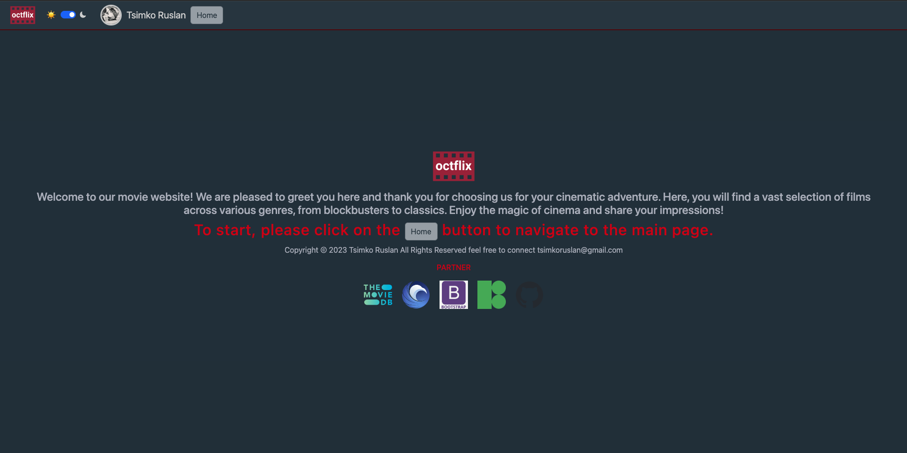
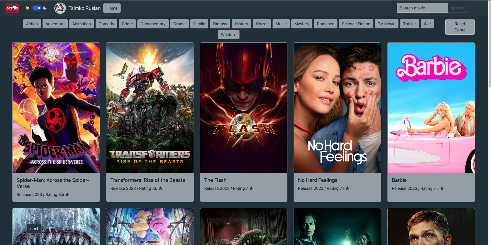
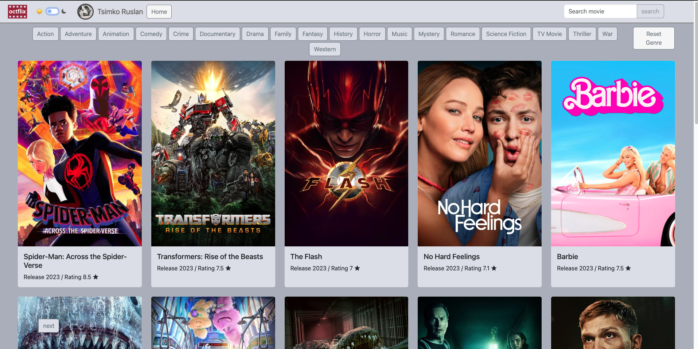
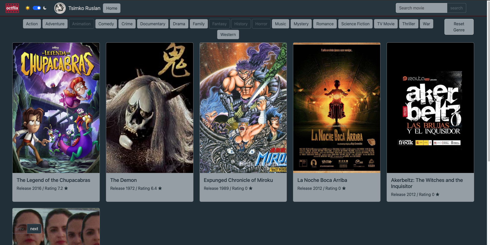
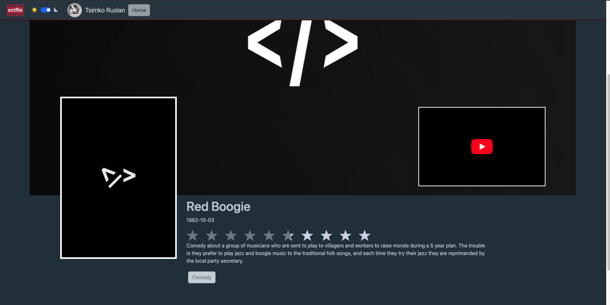
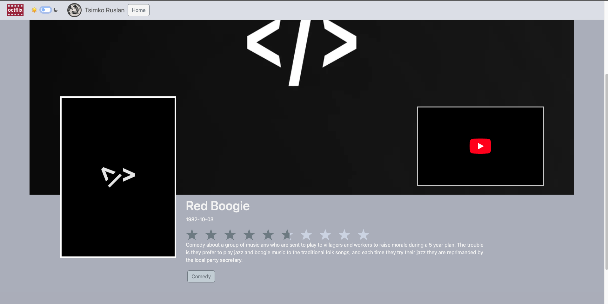

# OCTFLIX
Movie Platform built with React

# Key Features
- Film search: Perform film search by title, genre, or year of release.

- Film details: Retrieve detailed information about a film, such as its description, rating, duration, and more.

- Rating and reviews: Leave your ratings and reviews for films.
- 
## Available Scripts

In the project directory, you can run:

### `npm start`

Runs the app in the development mode.\
Open [http://localhost:3000](http://localhost:3000) to view it in the browser.

# Screenshot :

